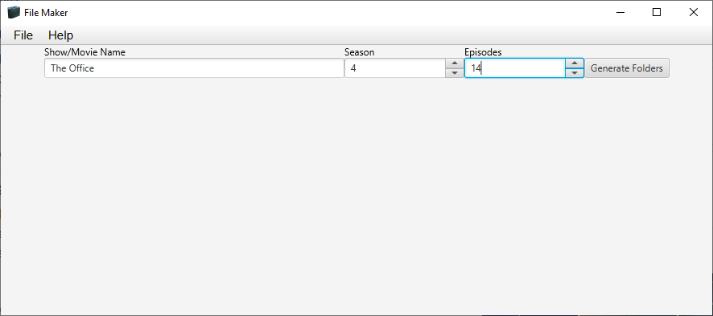

# File Maker
## Use
* Allows user to mass create folders for TV shows
* User enters show name and selects the season and how many episodes
* After selecting a directory to output folders (in "File" -> "Choose Directory")
* Click "Generate Folders" to have folders generating

